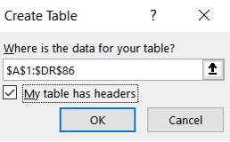
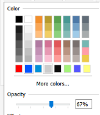
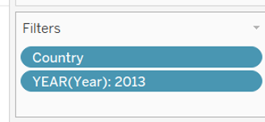

```{r setup, include=FALSE}
knitr::opts_chunk$set(echo = FALSE)
```
# 1.0 Critique of Visualisation 

The original visualisation is shown below.


##  1.1 Clarity 

a.	No title and legend in the graph
Without title of graph, readers cannot extract the main objective of the graph. There is no specific illustration about time frame of the data extracted from the graph. 

b.	Inconsistent axis header
Names of both y-axis and x-axis are inconsistent. For instance, there are two headers in x-axis: “NET EXPORTS” and “Exports”. Reader might be confused which value it is. 

c.	Unclear of derived values
There is no explanation of calculation of net import and net export. 

d.	Unclear source of comment
There is short paragraph describe trading in Singapore between China and United States in the bottom of picture. Those information cannot be observed from the graph which lacks evidence. 


## 1.2 Aesthetic

a. Too many colors in the graph 
There are ten countries in the graph, each of them has one color but they stand for the same meaning: total number of trading volume in the year. Rainbow colors should be avoided. 

b. Repeating monetary units
Every amount in the graph has a monetary unit S$ xx Bil in the graph. It was repeated for ten times.

c. Full opacity
There are areas where countries overlap each other, due to full opacity, it is covered and block reader’s from full picture of the graph.

d. Confusing position of top net importer and top net exporter sign
Sign of top net importer and top net exporter are positioned above countries. The shape of the sign is circle which looks like countries whose sign is also circle. Readers might treat them as countries at a glance.  


# 2.0 Alternative Design

The proposed design is shown in the following. 


## 2.1 Clarity 

a. Interactive panel allows audience to choose countries select and animations allow readers to see how trading volume changes over time. 

b. Box plot is used to show uncertainty distribution variability over time.

c. Outliers can show clearly what are months trading falls out of normal range and it can be reflected in responding heat map. 


## 2.2 Aesthetic

a. Annotations are used to emphases key observations. 
b. Bright and contrastive colors are applied so that readers can focus on their interested category.

# 3.0 Proposed Visualisation
For a clearer graph, please click the link on Tableau Public [here.](https://public.tableau.com/app/profile/shuxian.jovina.li/viz/Makeover2_16241728914600/Dashboard1)

# 4.0	Step-by-step Guide

1. Open raw data using excel. 


2. Remove first 5 rows in both spreadsheet T1 and T2 to ensure header is in first row.


3. Remove row 2 to row 8 in both sheet T1 and T2, since those rows are cumulative values for continents. 


4. Delete row 115 to 128 in sheet T1 as they are commentary. Similarly, repeat that in T2.


5. Remove column B to PE since requested period is between January 2011 to December 2020 in both sheets. Similarly, remove data from January 2021 to April 2021 in both sheets.


6. Insert a new column in sheet T1, name it as “Type”, fill the rows with “Import”. Repeat the same procedure in sheet T2 except the name is “Export” instead. 

{width=50%}

7. Set range of table to better insert into tableau.

{width=50%}

{width=50%}

8. Select variables and type and unpivot rest of columns.

{width=40%}

9. Rename the 3rd and 4th columns into month and trade value, respectively. 

{width=80%}

10. Close and load the table, a new table 1 will appear, rename the sheet as import. 

{width=75%}

11. Multiply trade value by 1000 to reflect real trading amount.

{width=50%}

12. Repeat step g to k in export sheet as well. Combine these 2 tables into a new excel workbook. Inner join the table by country name and month of the year. 


13. Rename the variables and change datatype of month from string to date.

{width=30%}

14. create new variables Net Import and Net Export using calculation field. 

{width=50%}

15. Create upper and lower bond for net export. 

{width=50%}

16. Drag lower and upper bound to measure values.

{width=40%}

17. Put month in column, sum of net export and measure values in rows. Filter by country and measure names. 

{width=90%}

18. Add average reference line, change the format and add the customized label. 

{width=40%}

19. Create new variable Outlier and drag it into color pane.

{width=40%}
{width=20%}

20. Edit title of graph, insert variable country.

{width=50%}

21. Chart: Net Export time series with outliers is completed shown as such. Repeat the same step to create Net Import chart. 

{width=70%}

22. Create a new sheet, drag month of year to column and year in row to create a heatmap. 

{width=50%}

23. Drag net export to color and measure names to detail. 

{width=30%}

24. Apply filter by country. A heat map is created completely. 

{width=50%}

25. To show uncertainties of net import over time, box plot is created. Drag year to columns, net export as rows.  

{width=20%}

26. Create 2 new variables, positive/negative net export using if condition and drag them into tooltip. 

{width=50%}

27. Add filter by country and measure names as well. Drag month of year and measure names into tooltip.

{width=30%}

28. Edit tooltip where net export with negative value is blue color while positive one is red.

{width=50%}

29. Adjust size of circle and reduce opacity.

{width=30%}
{width=30%}

30. Edit title of graph, insert variable country.

{width=50%}

31. Box plot is completed as shown.

{width=80%}

32. Create ranking variables using rank_dense for net export and also net import.

{width=50%}

33. Create a new sheet, drag country to column and net export to rows. 

{width=50%}

34. Apply year, net export and country (to select multiple countries) to filter.

{width=30%}

35. Drag export trade value, import trade value, net import ranking, net export ranking, net export, positive net export, negative net import, year into detail. Choose net export to color pane.

{width=20%}

36. Click sort to rank them in descending order.

{width=30%}

37. Edit tooltip as below. 

{width=70%}

38. The final main panel is shown. 

{width=70%}

39. Open a dashboard to drag all these graphs inside, select automatic size. 

{width=30%}

40. Switch on animation for all sheets.

{width=30%}

41. Show filter of countries, select worksheet it applies.

{width=50%}

42. Show filter of year and multiple countries, select single value for first country and period. 

{width=20%}

{width=20%}

43. Show highlight of all field.

{width=30%}

44. Hide time series header for net import.

{width=70%}

45. The final dashboard is ready.
{width=100%}

# 5.0	Derived Insights 

1.	**Mainland China:** The net export results from January 2011 to December 2018 shows an average performance between $1,221,107,952 and -$38,569,636. There was a sharp decreased in net export in January 2019 which rates about -$1,178,839,000. This sharp fall bounced right back to $1,832,598,000 on the following month, February 2019. Outstanding increase of net export value also shown in August 2019 which performed a highest rate among all the years about $2,077,969,000.


2.	**United States of America: ** Back in January 2011 to January 2020, there is an underperformance net exports shown in the graph which range between -$511,229,502 to -$1,996,866,464. In the year of 2020, U.S net export values increased from -$568.861,000 to $2 billion. This outstanding performance started from January 2020 to July 2020.


3.	**Thailand: ** Starting from January 2011, Thailand has an average performance of their net export values till September 2019. The performance increased to $1.4 billion from September 2019 to March 2020. However, the following month in April 2020, there was a noticeable drop to -$5.6 million. 


